# Adaptive TT Layer

All model projections are tensorized via TT decomposition. Adaptiveness comes from diagonal additions between cores.

## NanoGPT (5M)

### Results
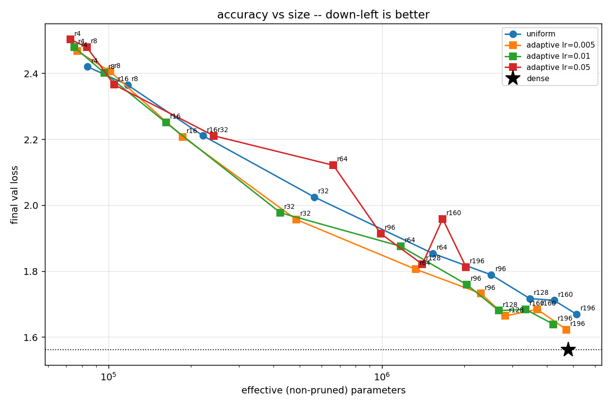

### Wall-clock time

One step:
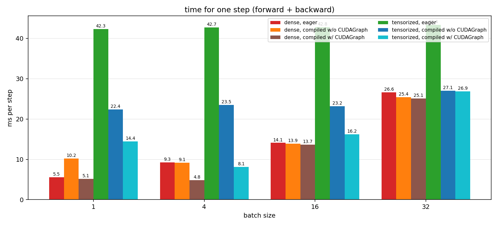

<!-- One forward epoch:
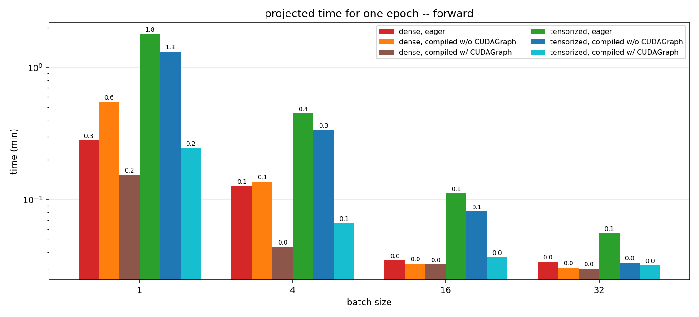

One backward epoch:
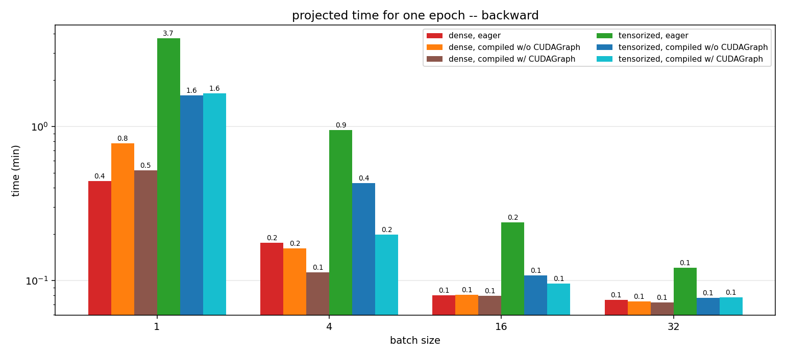 -->

### Memory

#### Static memory

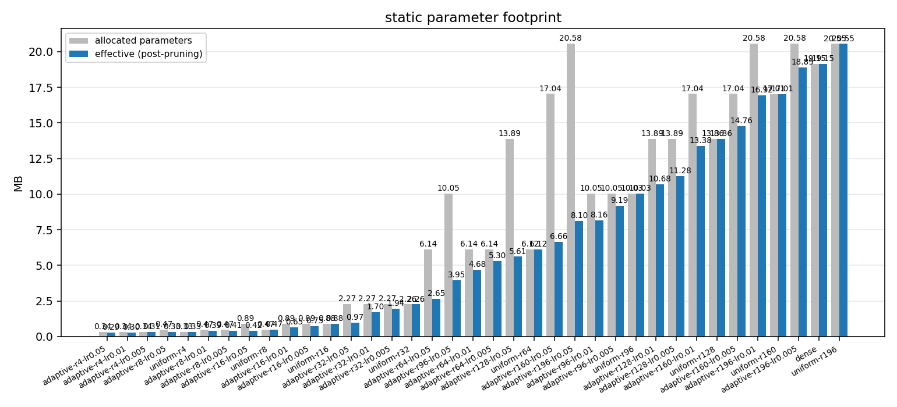

#### Peak memory

For inference step:
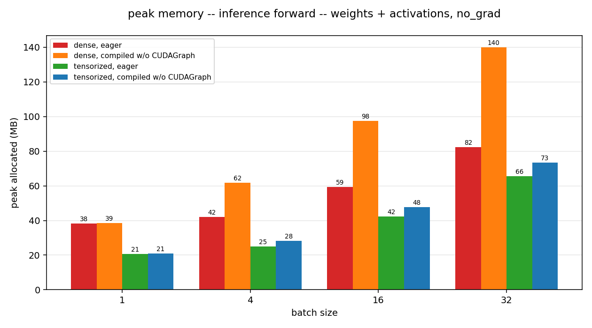

For training step:
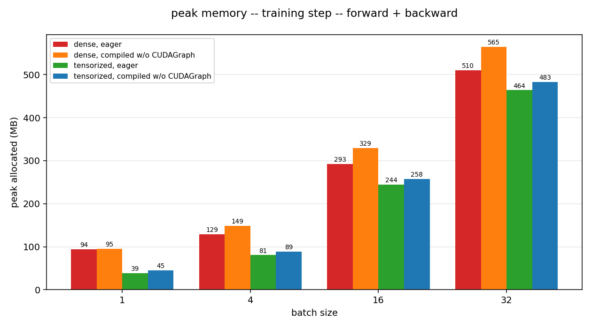

### Ranks distribution

- c_attn - Q, K, V projections in attention
- attn_proj - output projection in attention
- c_fc - up projection in FFN
- mlp_proj - down projection in FFN

Pruned ranks distribution:

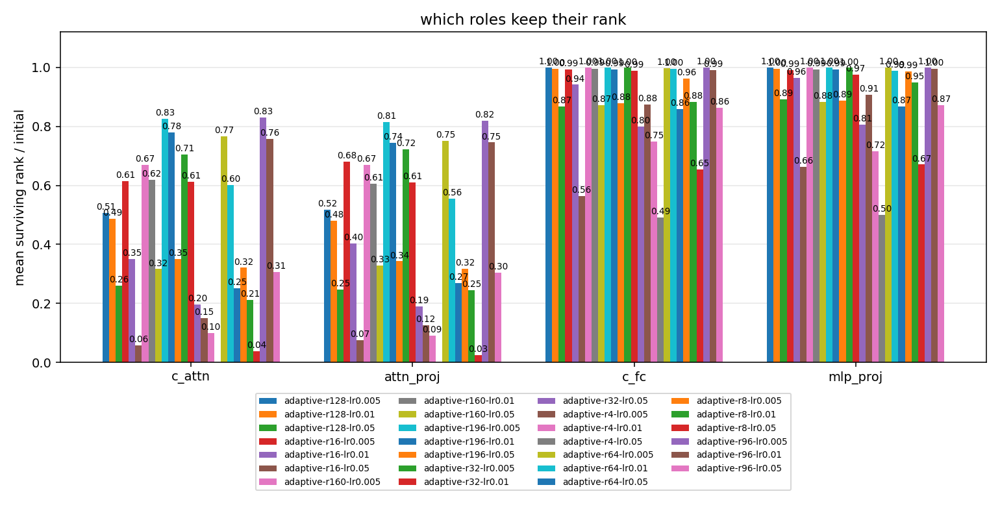

Unpruned/pruned ranks heatmap:

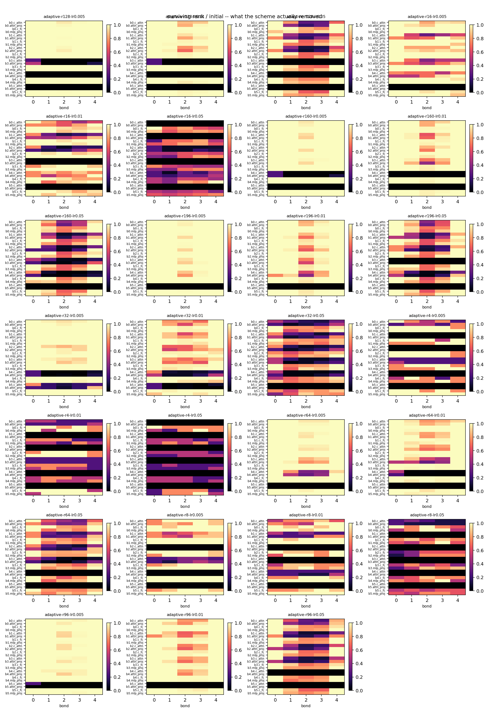

### Training dynamics

Left diagrams - quantiles of core entries distribution.

Right diagrams - gradients of cores and mean rank dynamics.
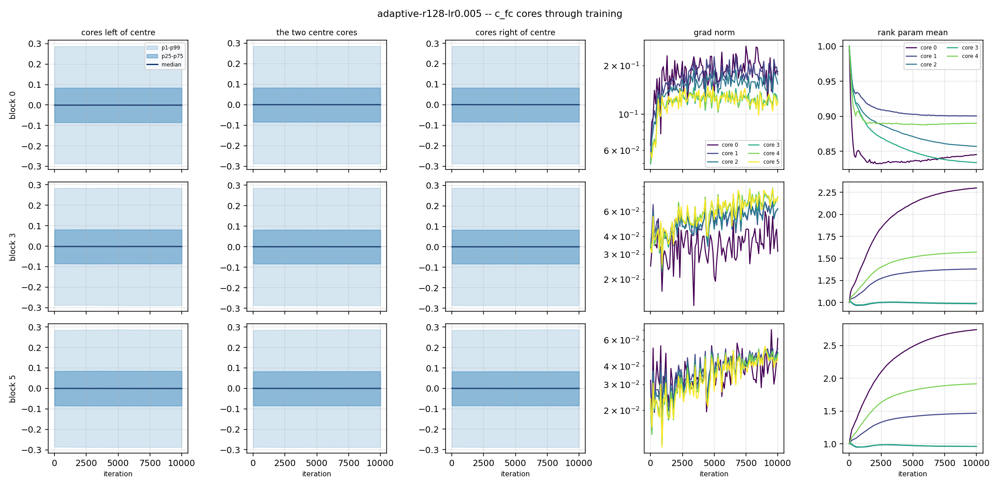

## GPT-2 small (125M)

### Results

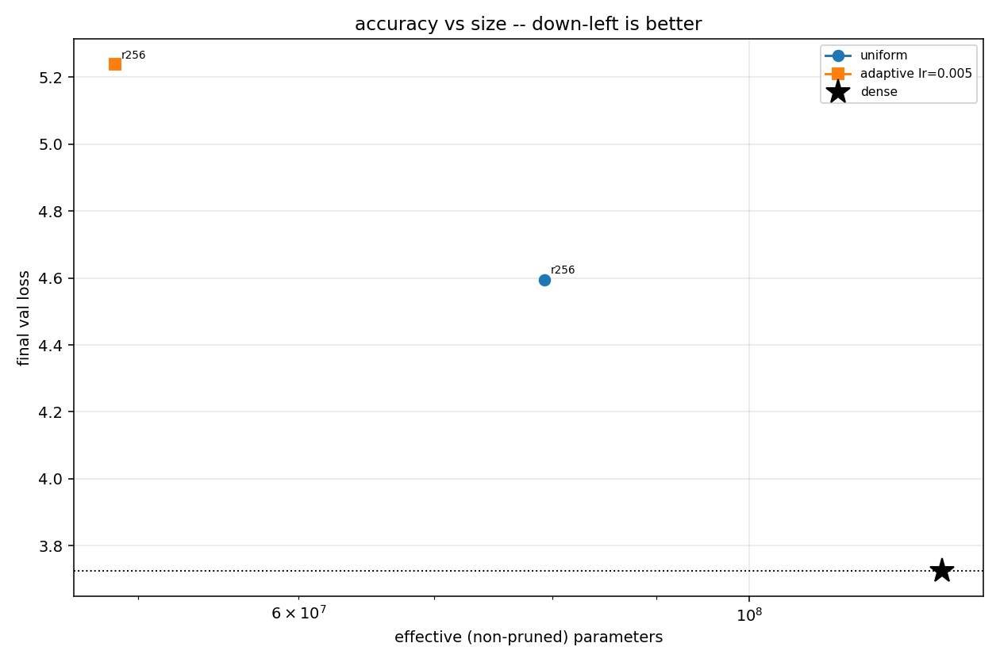

### Wall-clock time

One step:
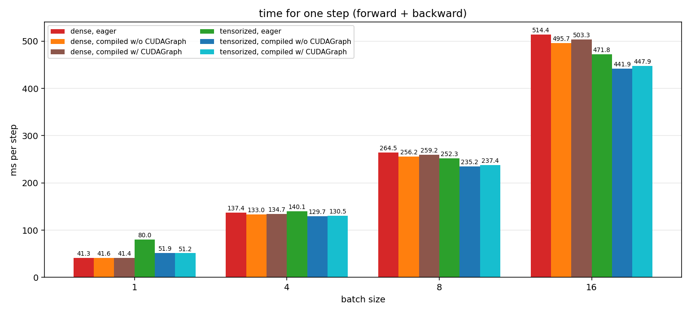

<!-- One forward epoch:
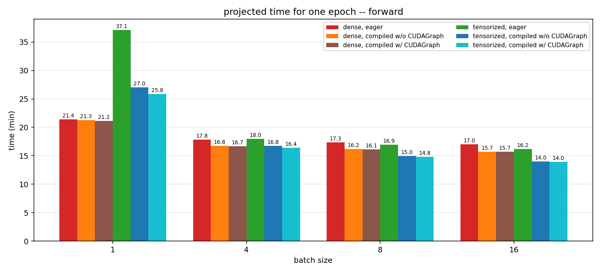

One backward epoch:
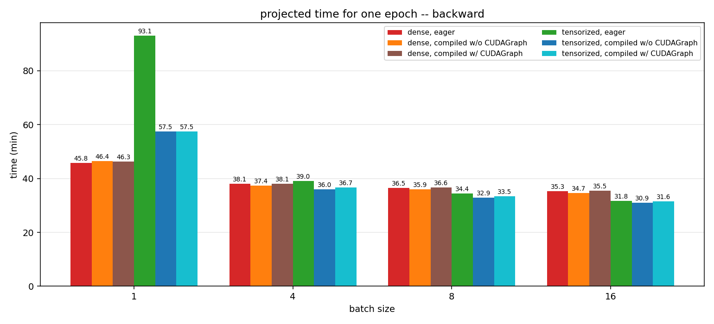 -->

### Memory

#### Peak memory

For inference step:
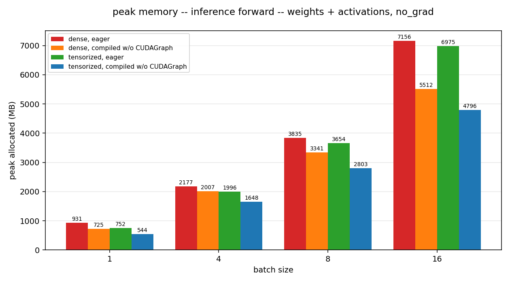

For training step:
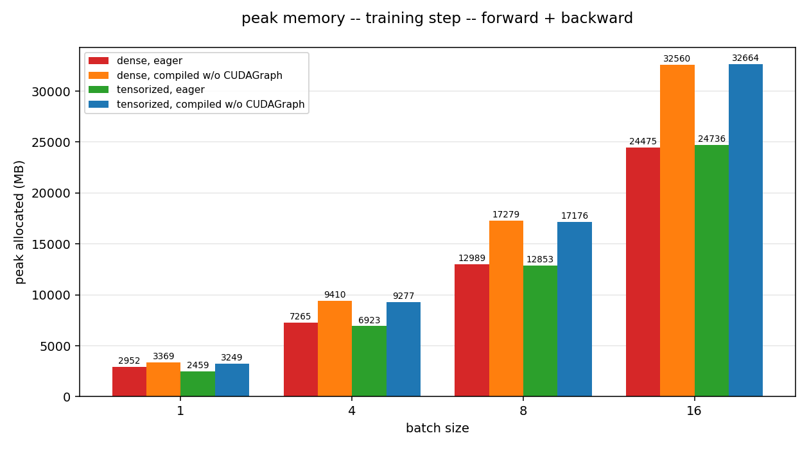